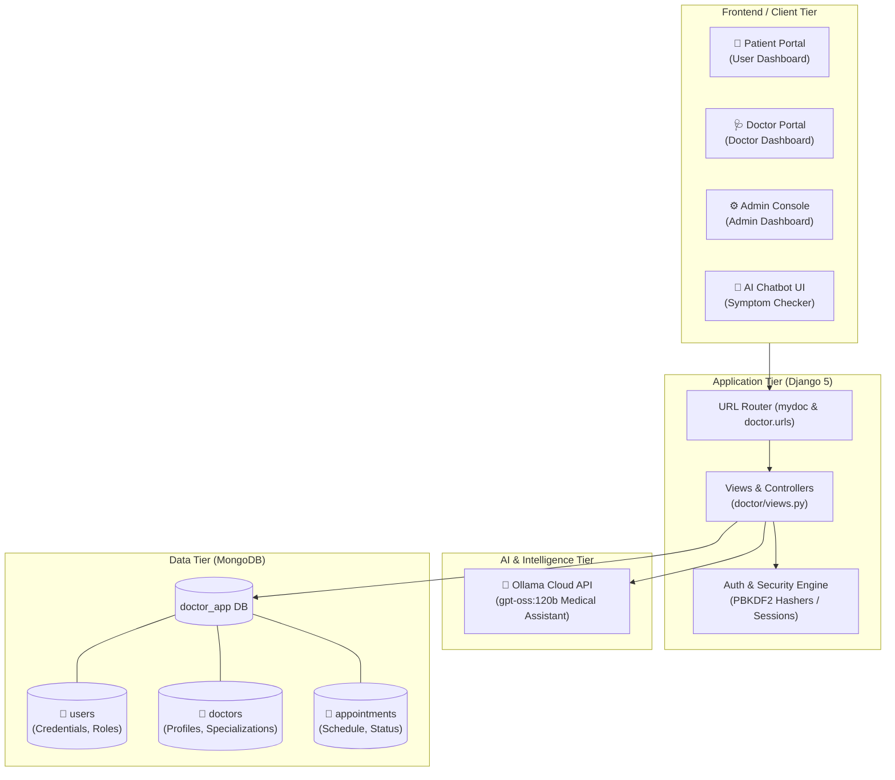

<div align="center">

# 🩺 MyDoc — Intelligent Healthcare & Telemedicine Platform

[](https://www.djangoproject.com/)
[](https://www.python.org/)
[](https://www.mongodb.com/)
[](https://ollama.com/)
[](https://getbootstrap.com/)
[](LICENSE)

<p align="center">
  <b>A comprehensive, full-stack healthcare ecosystem uniting Patients, Doctors, and Administrators with an integrated AI Medical Assistant.</b>
</p>

[Explore Features](#-key-features) •
[System Architecture](#-system-architecture) •
[Quick Start](#-installation--quick-start) •
[API Documentation](#-api-reference) •
[Role Walkthrough](#-role-based-dashboards) •
[Database Schema](#-database-architecture)

---

</div>

## 📌 Executive Summary

**MyDoc** is a modern telemedicine and clinic management web application built with **Django** and **MongoDB**, supercharged by **Ollama Cloud AI**. The platform streamlines the entire patient consultation lifecycle: from automated symptom inquiry with a specialized medical LLM to seamless specialist discovery, conflict-free appointment scheduling, and dedicated role-specific operational dashboards for patients, doctors, and system administrators.

---

## 🚀 Key Features

<table>
  <tr>
    <td width="50%">
      <h3>🤖 AI-Powered Medical Consultation</h3>
      <ul>
        <li>Integrated <b>Ollama Cloud AI</b> running large language models for symptom triage.</li>
        <li>Instant clinical guidance and health recommendations 24/7.</li>
        <li>Accessible directly from the patient interface without appointment delays.</li>
      </ul>
    </td>
    <td width="50%">
      <h3>📅 Smart Appointment Management</h3>
      <ul>
        <li>Interactive slot booking with automatic past-date prevention.</li>
        <li>Double-booking collision protection per doctor and date.</li>
        <li>Real-time status tracking: <code>Pending</code> ⏳, <code>Approved</code> ✅, <code>Rejected</code> ❌.</li>
      </ul>
    </td>
  </tr>
  <tr>
    <td width="50%">
      <h3>👥 Tri-Tier Role Architecture</h3>
      <ul>
        <li><b>Patient Portal:</b> Specialist discovery, appointment booking, status tracker.</li>
        <li><b>Doctor Workspace:</b> Appointment queue, one-click approval/rejection workflows.</li>
        <li><b>Admin Command Center:</b> Clinic-wide analytics, doctor onboarding, user control.</li>
      </ul>
    </td>
    <td width="50%">
      <h3>🔒 Robust Security & Performance</h3>
      <ul>
        <li>Cryptographic password hashing using Django PBKDF2 algorithms.</li>
        <li>Clean decoupling with JSON REST endpoints and responsive UI.</li>
        <li>Unified environment configuration via <code>django-environ</code>.</li>
      </ul>
    </td>
  </tr>
</table>

---

## 🏛 System Architecture

The following diagram illustrates how the presentation layer, Django application logic, MongoDB NoSQL database, and Ollama AI cloud service interact:



---

## 💻 Tech Stack

| Domain | Technology | Purpose |
| :--- | :--- | :--- |
| **Backend Framework** | [Django 5.2](https://www.djangoproject.com/) | Web routing, view logic, templating, security |
| **Database** | [MongoDB](https://www.mongodb.com/) + [PyMongo](https://pymongo.readthedocs.io/) | Schema-flexible document database for healthcare records |
| **Artificial Intelligence**| [Ollama Cloud](https://ollama.com/) | Cloud LLM integration for conversational medical inquiries |
| **Configuration** | [django-environ](https://django-environ.readthedocs.io/) | 12-Factor app environment variable management |
| **Styling & UI** | [Bootstrap 5.3](https://getbootstrap.com/), [FontAwesome 6](https://fontawesome.com/) | Modern responsive glassmorphic design and iconography |
| **Typography** | Google Fonts (Inter, Poppins) | Clean readability and modern typography |

---

## 📂 Directory Structure

```text
MyDoc/
├── doctor/                      # Core Healthcare Django Application
│   ├── migrations/              # Django DB migrations
│   ├── admin.py                 # Django admin registration
│   ├── apps.py                  # App configuration
│   ├── models.py                # Django models
│   ├── tests.py                 # Application unit tests
│   ├── urls.py                  # Routing for UI & REST API endpoints
│   ├── utilis.py                # Utility helpers (JSON parsing, ObjectIDs)
│   └── views.py                 # Business logic, Auth, DB operations & AI
├── mydoc/                       # Django Project Configuration Root
│   ├── asgi.py                  # ASGI server entry point
│   ├── db.py                    # PyMongo client initialization & collections
│   ├── settings.py              # Environment config, static paths, apps
│   ├── urls.py                  # Primary project routing
│   └── wsgi.py                  # WSGI server entry point
├── static/                      # Static Assets (Images, Icons, Media)
│   ├── doctors/                 # Doctor avatar photography
│   ├── services/                # Healthcare department visuals
│   ├── img1.png                 # Hero carousel slides
│   ├── img2.jpg
│   └── img3.png
├── templates/                   # Semantic HTML5 Templates
│   ├── base.html                # Master layout with responsive navbar & footer
│   ├── index.html               # Landing page with hero banner & carousel
│   ├── about.html               # Clinic vision, mission & background
│   ├── services.html            # Medical specialty catalog & department cards
│   ├── contact_us.html          # Contact form & clinic communication channels
│   ├── login.html               # Multi-role authentication & registration modal
│   ├── doctors.html             # Public doctor portfolio & credentials showcase
│   ├── chatbot.html             # Interactive AI doctor consultation interface
│   ├── user_dashboard.html      # Patient portal: doctor booking & appointment log
│   ├── doctor_dashboard.html    # Practitioner console: real-time patient queue
│   └── admin_dashboard.html     # Clinic administration & doctor enrollment
├── .gitignore                   # Version control exclusion rules
├── manage.py                    # Django management script
└── README.md                    # Project documentation & reference
```

---

## ⚡ Installation & Quick Start

### 1. Prerequisites

Make sure the following are installed on your workstation:
- **Python 3.11+** ([Download Python](https://www.python.org/downloads/))
- **MongoDB** running locally on port `27017` or a cloud [MongoDB Atlas](https://www.mongodb.com/atlas) connection URI.
- **Git** ([Download Git](https://git-scm.com/))

---

### 2. Clone the Repository

```bash
git clone https://github.com/Risshhhiiii/MyDoc.git
cd MyDoc
```

---

### 3. Set Up Virtual Environment

<details open>
<summary><b>Click to view OS-specific virtual environment instructions</b></summary>

#### On Windows (PowerShell / CMD):
```powershell
python -m venv venv
.\venv\Scripts\activate
```

#### On macOS / Linux:
```bash
python3 -m venv venv
source venv/bin/activate
```

</details>

---

### 4. Install Dependencies

Install the core dependencies:

```bash
pip install django django-environ pymongo ollama
```

---

### 5. Configure Environment Variables

Create a `.env` file in the root directory (`MyDoc/.env`):

```ini
# MongoDB Configuration
MONGO_URI=mongodb://localhost:27017
MONGO_DB_NAME=doctor_app

# System Admin Credentials
ADMIN_USERNAME=admin
ADMIN_PASSWORD=admin123

# Ollama AI Configuration (Optional / if using Cloud AI)
OLLAMA_API_KEY=your_ollama_key_here
```

Customize the values in `.env` as needed:

| Variable | Default Value | Description |
| :--- | :--- | :--- |
| `SECRET_KEY` | `django-insecure-...` | Django cryptographic signing key |
| `DEBUG` | `True` | Set to `False` in production |
| `MONGO_URI` | `mongodb://localhost:27017` | Connection string for MongoDB instance |
| `MONGO_DB_NAME`| `doctor_app` | MongoDB database identifier |
| `ADMIN_USERNAME` | `admin` | Default Superadmin username |
| `ADMIN_PASSWORD` | `admin123` | Default Superadmin password |
| `OLLAMA_API_KEY` | *(Configurable)* | API Key for Ollama Cloud AI services |

---

### 6. Run Migrations & Launch Server

```bash
# Initialize SQLite baseline for Django core
python manage.py migrate

# Start the development server
python manage.py runserver
```

Visit the application at: **`http://127.0.0.1:8000`** 🚀

---

## 👥 Role-Based Dashboards & Workflows

<details>
<summary><b>🏥 1. Patient (User) Journey</b></summary>
<br>

1. **Sign Up / Login:** Navigate to the `/login/` portal, select **Patient**, and authenticate or create an account.
2. **Explore Specialists:** Browse doctor profiles, medical credentials, and available schedules at `/doctors/`.
3. **Book Appointment:** Access `/user_dashboard/?user=<username>`, choose a specialist, select any future date, and confirm booking.
4. **Live Status Tracking:** Review the interactive appointments table to check real-time status (`Pending`, `Approved`, `Rejected`).
5. **AI Consultation:** Visit `/chatbot/` to converse with the medical AI assistant about symptoms and recommendations.

</details>

<details>
<summary><b>🩺 2. Medical Practitioner (Doctor) Journey</b></summary>
<br>

1. **Sign In:** Select **Doctor** from the login dropdown and log in with your assigned practitioner username.
2. **Review Consultations:** Open `/doctor_dashboard/` to view incoming patient requests with dates and patient names.
3. **One-Click Actions:** Click **Approve** (green) or **Reject** (red) to update the status in the MongoDB database immediately.

</details>

<details>
<summary><b>⚙️ 3. Clinic Administrator Journey</b></summary>
<br>

1. **Authentication:** Select **Admin** on `/login/` using the system credentials defined in `.env` (default: `admin` / `admin123`).
2. **Onboard Doctors:** Fill in the new doctor's full name, username, initial password, and clinical designation to instantly register them in the system.
3. **Clinic Metrics:** Monitor registered doctors and track aggregate appointment metrics across all specialists.

</details>

---

## 📡 API Reference

All asynchronous dashboard actions are driven by clean RESTful JSON endpoints.

<details open>
<summary><b>Interactive API Specification Table</b></summary>

| HTTP Method | Route | Description | Request Body / Query |
| :--- | :--- | :--- | :--- |
| `POST` | `/api/user/login-register/` | Authenticate or register a new patient | `{"username": "...", "password": "...", "register": true/false}` |
| `POST` | `/api/doctor/login/` | Doctor authentication | `{"username": "...", "password": "..."}` |
| `POST` | `/api/admin/login/` | Administrator authentication | `{"username": "...", "password": "..."}` |
| `POST` | `/api/admin/add-doctor/` | Register a new doctor profile into the database | `{"admin_user": "...", "admin_pass": "...", "username": "...", "password": "...", "name": "...", "designation": "..."}` |
| `GET` | `/api/doctors/all/` | Retrieve a sanitized list of all registered doctors | *None* |
| `GET` | `/api/doctor/<doctor_name>/appointments/` | Fetch appointment queue for a specific doctor | `doctor_name` in URL |
| `POST` | `/api/appointment/book/` | Book a doctor appointment (with validation) | `{"doctor_id": "...", "username": "...", "day": "YYYY-MM-DD"}` |
| `POST` | `/api/appointment/update/` | Approve or reject a pending appointment | `{"id": "<ObjectId>", "action": "approve" \| "reject"}` |

</details>

---

## 🗄 Database Architecture

MyDoc utilizes **MongoDB** collections inside the `doctor_app` database:

```text
doctor_app/
├── users
│   ├── _id: ObjectId
│   ├── username: String (lowercase, unique)
│   ├── password: String (PBKDF2 SHA-256 hashed)
│   └── role: "user"
│
├── doctors
│   ├── _id: ObjectId
│   ├── username: String (lowercase, unique)
│   ├── name: String
│   ├── password: String
│   ├── specialization: String
│   ├── designation: String
│   └── work_days: String ("Mon-Sat")
│
└── appointments
    ├── _id: ObjectId
    ├── doctor: String (doctor username)
    ├── user: String (patient username)
    ├── day: String ("YYYY-MM-DD")
    ├── status: "Pending" | "Approved" | "Rejected"
    └── created_at: ISODate
```

---

## 🧪 Testing & Verification

To verify that the application and environment pass all system integrity checks:

```bash
# Verify Django configurations, models, and registered apps
python manage.py check

# Run automated tests
python manage.py test
```

---

## 🛠 Troubleshooting

<details>
<summary><b>1. MongoDB Connection Error: <code>ServerSelectionTimeoutError</code></b></summary>
Ensure MongoDB is running locally or verify that your <code>MONGO_URI</code> in <code>.env</code> is reachable. To start MongoDB on Windows:
```powershell
net start MongoDB
```
Or start via mongod:
```bash
mongod --dbpath <data-directory-path>
```
</details>

<details>
<summary><b>2. AI Chatbot Returns: <code>Error contacting Ollama Cloud</code></b></summary>
Verify that your <code>OLLAMA_API_KEY</code> in <code>.env</code> is active and your machine has access to <code>https://ollama.com/v1</code>.
</details>

<details>
<summary><b>3. Missing Python Modules</b></summary>
Run:
```bash
pip install django django-environ pymongo ollama
```
to ensure <code>django-environ</code>, <code>pymongo</code>, <code>ollama</code>, and <code>Django</code> are properly installed.
</details>

---

## 🤝 Contributing

Contributions, feature requests, and bug reports are warmly welcomed!

1. **Fork** the Repository
2. **Create** your Feature Branch (`git checkout -b feature/AmazingFeature`)
3. **Commit** your Changes (`git commit -m 'Add some AmazingFeature'`)
4. **Push** to the Branch (`git push origin feature/AmazingFeature`)
5. **Open** a Pull Request

---

## 📄 License

This project is licensed under the **MIT License** — see the [LICENSE](LICENSE) file for details.

---

<div align="center">
  <sub>Developed with ❤️ for modern healthcare. Designed and maintained by Rishi Sharma.</sub>
</div>
